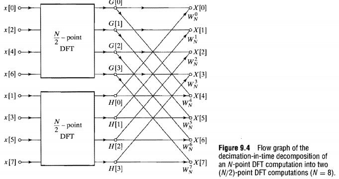

[TOC]
>本文地址：https://github.com/HeLiangHIT/fft_radix

#FFT快速算法的MATLAB示例：可以提供C语言的实现思路

>FFT算法的实现，主要参考“《离散时间信号处理》第二版  -- 奥本海姆 ” 第九章实现的FFT算法，包括五种FFT快速算法的递归实现和非递归实现。下面主要介绍递归的实现，非递归的代码参考网上（我也不记得在哪儿来的了），递归实现的函数简要介绍如下：


1. fft_radix2t 是按时间抽选的基2-FFT递归算法，其程序实现流程如下：
 
```matlab
function X = fft_radix2t(x)
% 按时间抽选的基2，FFT递归算法，输入必须是2的整数次幂
% 参考：《离散时间信号处理》第二版  -- 奥本海姆  513页 图9.3
x = x(:).';
N = length(x);

if (N == 2)
    X = fft(x);%其实就是简单的一个蝶形运算
else
    g = x(1:2:N-1); % N/2 点偶序列  x[n]: x[0], x[2], x[4], ..., x[N-2].
    h = x(2:2:N);   % N/2 点奇序列 x[n]: x[1], x[3], x[5], ..., x[N-1].

    G1 = fft_radix2t(g);
    H1 = fft_radix2t(h);

    %相位翻转
    k = 0:N-1;
    W = exp(-1i*2*pi*k/N);

    H = [H1 H1];
    G = [G1 G1];

    X = G + W.*H;
end
```
2. fft_radix2f 是按频率抽选的基2-FFT递归算法，其程序实现流程如下：
 
```matlab
function X = fft_radix2f(x)
% 按频率抽选的基2，FFT递归算法，输入必须是2的整数次幂
% 参考：《离散时间信号处理》第二版  -- 奥本海姆  522页 图9.17
x = x(:).';
N = length(x);

if (N == 2)
    X = fft(x);%其实就是简单的一个蝶形运算
else
    X = zeros(size(x));
    %相位翻转
    k = 0:N-1;
    W = exp(-1i*2*pi*k/N);
    
    g = x(1:(N/2)) + x((N/2+1):N);
    h = (x(1:(N/2)) - x((N/2+1):N)).*W(1:(N/2));

    G = fft_radix2f(g);
    H = fft_radix2f(h);

    X(1:2:N-1) = G;
    X(2:2:N) = H;
end
```
3. fft_radix4t 是按时间抽选的基4-FFT递归算法，其程序实现流程如下：
 
```matlab
function X = fft_radix4t(x)
% 按时间抽选的基4，FFT递归算法，输入必须是4的整数次幂
% 参考：《离散时间信号处理》第二版  -- 奥本海姆  514页 图9.5

x = x(:).';
N = length(x);

if(N==4 || N==2)
    X=fft(x);%其实就是简单的一个蝶形运算
else
    e = x(1:4:N-3); % N/4 点: x[0], x[4], x[8],   ..., x[N-4].
    f = x(2:4:N-2);  % N/4 点: x[1], x[5], x[9],   ..., x[N-3].
    g = x(3:4:N-1); % N/4 点: x[2], x[6], x[10], ..., x[N-2].
    h = x(4:4:N); % N/4 点: x[3], x[7], x[11], ..., x[N-1].
    
    E1 = fft_radix4t(e);
    F1 = fft_radix4t(f);
    G1 = fft_radix4t(g);
    H1 = fft_radix4t(h);

    %相位翻转
    k = 0:N-1;
    W = exp(-1i*2*pi*k/N);

    E = [E1 E1 E1 E1];
    F = [F1 F1  F1 F1];
    G = [G1 G1 G1 G1];
    H = [H1 H1 H1 H1];

    X = E + W.*F + (W.^2).*G + (W.^3).*H;
end
```
4. fft_radix4t 是按频率抽选的基2-FFT递归算法，其程序实现流程如下：
 
```matlab
function X = fft_radix4f(x)
% 按频率抽选的基4，FFT递归算法，输入必须是4的整数次幂
% 参考：《离散时间信号处理》第二版  -- 奥本海姆  522页 图9.18

x = x(:).';
N = length(x);

if(N==4 || N==2)
    X=fft(x);%其实就是简单的一个蝶形运算
else
    X = zeros(size(x));
    %相位翻转
    k = 0:N-1;
    W = exp(-1i*2*pi*k/N);
    
    g1 = x(1:(N/2)) + x((N/2+1):N);
    h1 = (x(1:(N/2)) - x((N/2+1):N)).*W(1:(N/2));
    
    e = g1((1):(N/4)) + g1((N/4+1):(N/2));
    f = (g1((1):(N/4)) - g1((N/4+1):(N/2))).*W(1:(N/4)).^2;
    g = h1((1):(N/4)) + h1((N/4+1):(N/2));
    h = (h1((1):(N/4)) - h1((N/4+1):(N/2))).*W(1:(N/4)).^2;
    
    E = fft_radix4f(e);
    F = fft_radix4f(f);
    G = fft_radix4f(g);
    H = fft_radix4f(h);

    % 注意输出顺序
    X(1:4:N-3) = E;
    X(2:4:N-2) = G;
    X(3:4:N-1) = F;
    X(4:4:N) = H;
    
end
```
5. fft_radixsplit 是按时间抽选的分裂基FFT递归算法，其程序实现流程如下：
 
```matlab
function X = fft_radixsplit(x)
% 时间抽选的分裂基，FFT递归算法，输入必须是2的整数次幂
% 参考：百度

x = x(:).';
N = length(x);
X = zeros(1,N);

if (N==4 || N==2)
    X=fft(x);
else
    g = x(1:2:N-1); % N/2 点: x[0], x[2], x[4],   ..., x[N-2].
    h = x(2:4:N-2);  % N/4 点: x[1], x[5], x[9],   ..., x[N-3].
    i = x(4:4:N);   % N/4 点: x[3], x[7], x[11], ..., x[N-1].
    
    G = fft_radixsplit(g);
    H = fft_radixsplit(h);
    I = fft_radixsplit(i);
    
    % 相位翻转
    k = 0:N/4-1;
    W = exp(-1i*2*pi*k/N);

    X(1:N/4)         = G(1:N/4)         + W.*H      +  (W.^3).*I;
    X(N/4+1:N/2)     = G(N/4+1:N/2)     - 1i*W.*H   +  1i*(W.^3).*I;
    X(N/2+1:3*N/4)   = G(1:N/4)         - W.*H      -  (W.^3).*I;
    X(3*N/4+1:N)     = G(N/4+1:N/2)     + 1i*W.*H   -  1i*(W.^3).*I;
end
```

** 总结： 其实按照时间抽取和按照频率抽取主要区别是，FFT递归运算步骤放在了流程图的前面还是后面！实际程序实现中需要在流程图各个步骤放置合理的中间变量以避免大脑被绕晕，其实FFT的快速实现算法还是很容易的嘛o( =•ω•= )m **